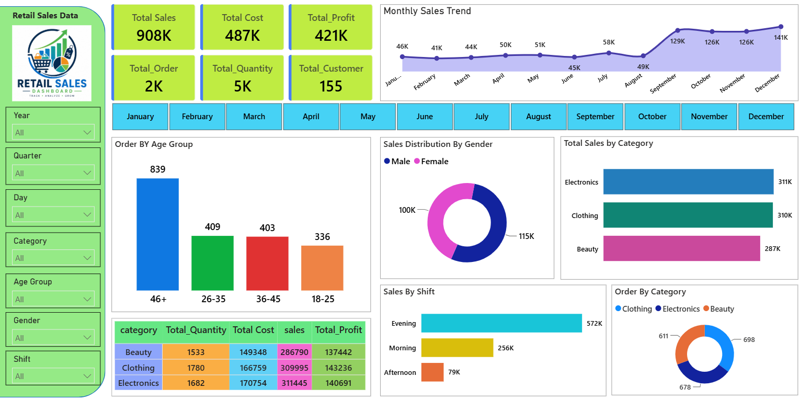

# 🛍️ Retail Sales Analysis & Power BI Dashboard
End-to-end retail sales analytics project using SQL for business analysis and Power BI for an interactive dashboard.

## 🎯 Project Objective
The objective of this project is to demonstrate how raw retail sales data can be analyzed using **SQL** and transformed into an interactive **Power BI dashboard** for business reporting and data-driven decision-making.

---
## 📊 Project Overview

This project is an **end-to-end Retail Sales Data Analytics project** focused on analyzing sales performance, customer behavior, product categories, profitability, and sales trends using **SQL and Power BI**.

The project includes SQL-based business analysis and an interactive **Power BI dashboard** designed to provide clear and actionable business insights.

---


## 🛠️ Tools & Technologies

* **SQL / PostgreSQL** – Data cleaning and business analysis
* **Power BI** – Interactive dashboard and visualization
* **Power Query** – Data transformation
* **DAX** – KPI and measure calculations
* **CSV** – Raw dataset

---

## 📁 Project Files

```text
Retail-Sales-Analysis/
│
├── README.md
│
├── Dashboard/
│   └── Retail_Sales_Dashboard.png
│
├── PowerBI/
│   └── Retail_Sales_Dashboard.pbix
│
├── Dataset/
│   └── Retail_Sales.csv
│
└── SQL/
    └── Retail_Sales_Queries.sql
```

---

## 📈 Power BI Dashboard

The Power BI dashboard provides an overview of retail sales performance.

### Key KPIs

* **Total Sales:** 908K
* **Total Profit:** 421K
* **Total Orders:** 2K
* **Total Customers:** 155

### Visualizations

* Sales and Profit Analysis
* Sales by Category
* Sales by Gender
* Sales by Shift
* Monthly Sales Trend
* Customer Analysis
* Order Performance

---

## 🔍 SQL Analysis

The SQL analysis covers several business questions, including:

* Data cleaning and null-value checks
* Sales by category
* Sales by gender
* Sales by shift
* Top 5 customers by spending
* Month-over-month sales growth
* Category-wise revenue contribution
* Sales and profit analysis
* Customer and order analysis

---

## 🧮 Key Business Questions

This project answers questions such as:

1. What are the total sales and profit?
2. Which categories generate the highest sales?
3. Which sub-categories generate the highest profit?
4. Which gender contributes more to sales?
5. Which shift generates the highest sales?
6. Who are the top customers by spending?
7. How do sales change month by month?
8. What percentage of revenue comes from each category?
9. Which products or categories perform best?
10. What are the overall customer and order trends?

---

## 📊 Dashboard Preview

### Retail Sales Dashboard


---

## 🔄 Project Workflow

```text
Raw Retail Sales Data
        ↓
Data Cleaning
        ↓
SQL Analysis
        ↓
Power Query Transformation
        ↓
DAX Measures & KPIs
        ↓
Power BI Visualization
        ↓
Business Insights
```

---

## 💡 Skills Demonstrated
* Data Cleaning
* SQL Querying
* Data Transformation
* Aggregation and Grouping
* Sales Analysis
* Customer Analysis
* Profitability Analysis
* Time-Series Analysis
* Power Query
* DAX
* KPI Development
* Dashboard Design
* Business Intelligence
* Data Visualization

---

## 🎯 Project Purpose

The purpose of this project is to analyze retail sales data and identify important patterns in sales, profit, orders, customers, product categories, and time-based performance.

The analysis helps transform raw retail data into meaningful business insights using **SQL and Power BI**.

---
## 👨‍💻 Author
Nitin Koshti
---

Data Analytics | SQL | Power BI | Excel
---
